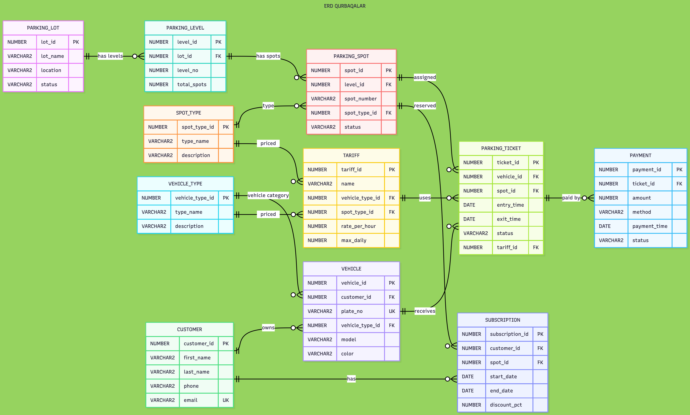
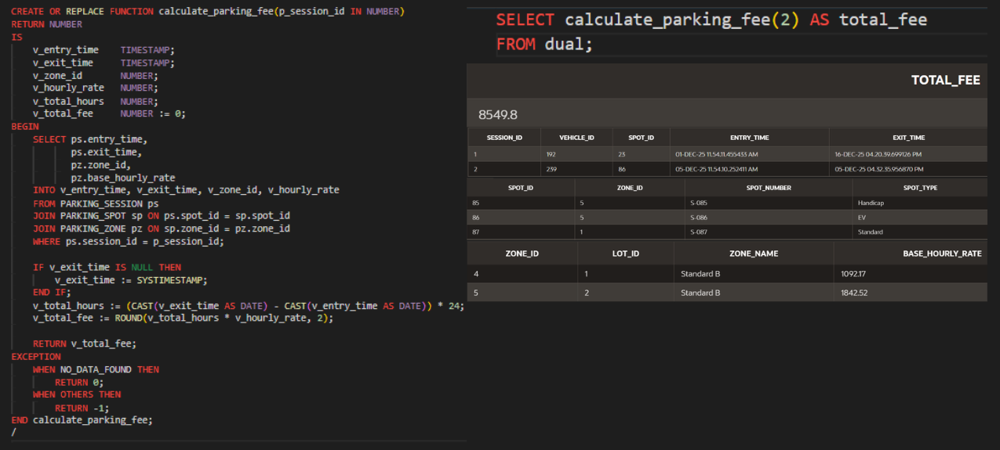
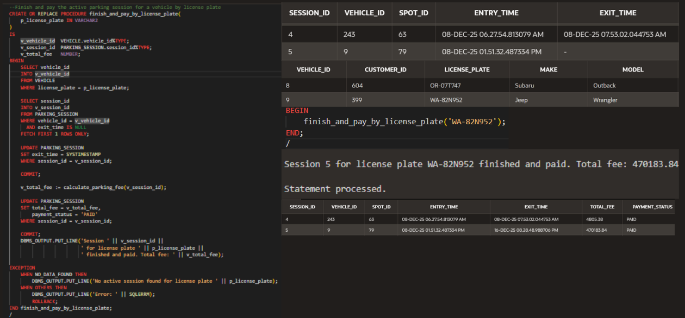
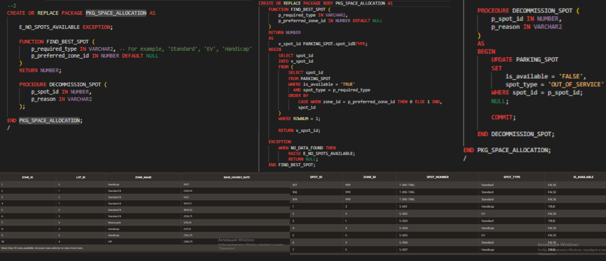
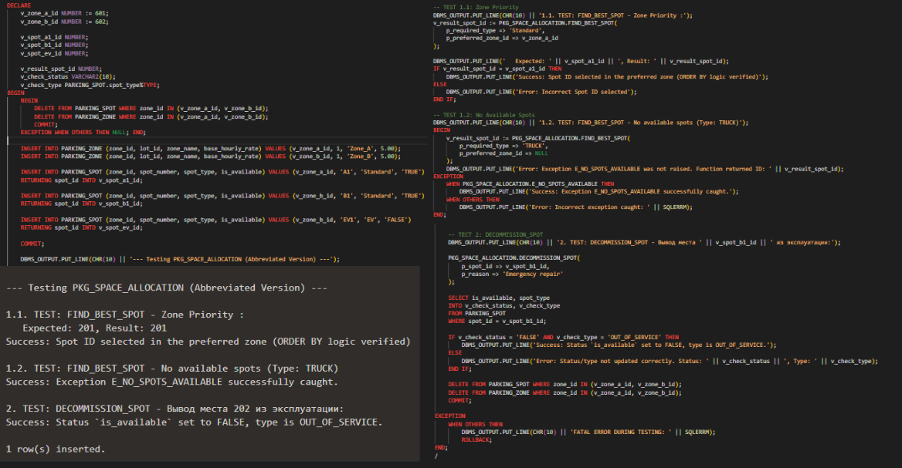
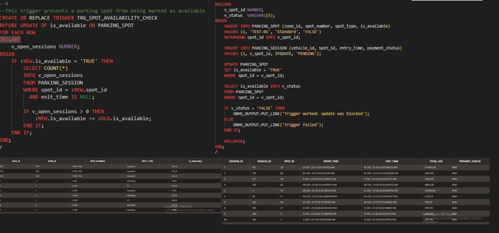
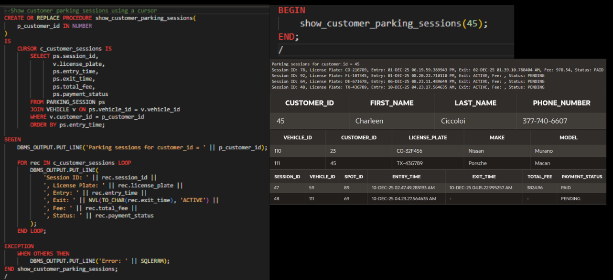
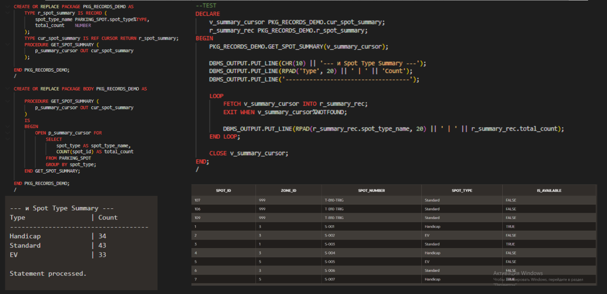
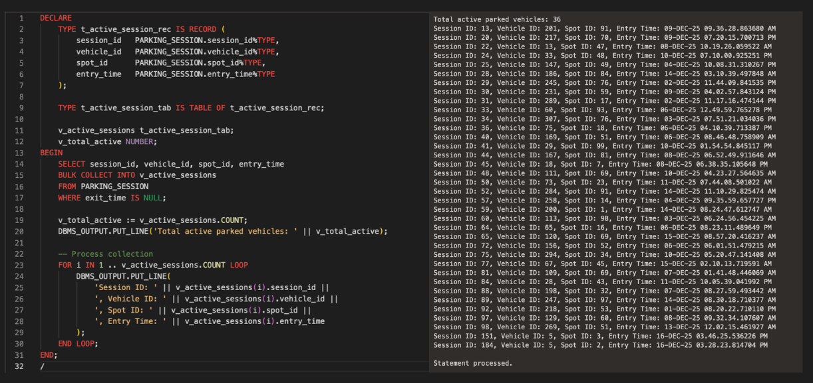

# 🚗 Parking Lot Management System

> A comprehensive Oracle SQL & PL/SQL database management system for managing parking lots, parking spaces, vehicles, subscriptions, parking sessions, and payments.


---

# 📖 Overview

Parking Lot Management System is a complete relational database project developed using **Oracle Database**, **PL/SQL**, and **Oracle APEX**.

The system simulates the operation of a real-world parking facility by managing:

- Parking lots
- Multiple parking levels
- Parking spaces
- Customers
- Vehicles
- Parking tickets
- Subscriptions
- Payments
- Dynamic parking tariffs

The project was developed as a final Database Systems course project and demonstrates the practical application of advanced SQL and PL/SQL concepts.

Unlike simple CRUD databases, this project includes business logic implemented directly inside the database using PL/SQL objects such as functions, procedures, packages, triggers, cursors, collections, and exception handling.

---

# ✨ Features

- Multi-level parking lot management
- Parking space allocation
- Vehicle registration
- Customer management
- Parking ticket generation
- Subscription management
- Payment tracking
- Automatic parking fee calculation
- Dynamic tariff selection
- Oracle APEX web interface
- Advanced SQL reporting

---

# 🛠 Technologies

- Oracle Database
- Oracle SQL
- PL/SQL
- Oracle APEX
- Oracle SQL Developer

---

# 🗂 Database Structure

The system consists of **11 normalized entities**.

| Table | Description |
|---------|-------------|
| PARKING_LOT | Parking lot information |
| PARKING_LEVEL | Levels within each parking lot |
| PARKING_SPOT | Individual parking spaces |
| SPOT_TYPE | Parking spot categories |
| VEHICLE_TYPE | Vehicle categories |
| VEHICLE | Registered vehicles |
| CUSTOMER | Customer information |
| TARIFF | Parking pricing |
| PARKING_TICKET | Vehicle parking sessions |
| PAYMENT | Payment history |
| SUBSCRIPTION | Long-term parking subscriptions |

---

# 📊 Entity Relationship Diagram



The database schema follows normalization principles and maintains referential integrity using primary keys, foreign keys, and unique constraints.

---

# ⚙️ Oracle APEX Interface

The project includes an Oracle APEX application that provides a user-friendly interface for interacting with the database.

Implemented operations include:

- Search
- Insert
- Delete

Screenshots are available in:

```
docs/screenshots/
```

---

# 🧠 Database Features

This project demonstrates the use of advanced Oracle Database features.

## Functions

PL/SQL functions were created to perform reusable business logic and return calculated values.

Example:

- Parking fee calculation
- Business rule validation

Screenshot:





## Stored Procedures

Stored procedures automate complex operations involving multiple SQL statements.

Examples include:

- Ticket creation
- Payment processing
- Parking session management

Screenshot:





---

## Packages

Related PL/SQL objects are organized into reusable packages.

Packages improve:

- Modularity
- Code organization
- Maintainability
- Reusability

Screenshots:







## Triggers

Triggers automatically enforce business rules whenever database events occur.

Examples:

- Automatic status updates
- Data validation
- Parking space synchronization

Screenshot:





## Cursors

Explicit cursors are used for processing query result sets row-by-row.

Cursor implementation demonstrates:

- Sequential data processing
- Report generation
- Business calculations

Screenshot:



## Records

Record types simplify handling multiple related fields within PL/SQL.

They improve:

- Readability
- Data manipulation
- Maintainability

Screenshot:





## Collections

Collections were implemented to efficiently process groups of related values.

The project demonstrates the use of PL/SQL collection methods for bulk data manipulation.

Screenshot:





## Exception Handling

Custom exception handling ensures reliable execution of PL/SQL code.

Implemented techniques include:

- NO_DATA_FOUND
- TOO_MANY_ROWS
- OTHERS
- User-defined validation

---

# 📈 SQL Queries

The project contains over **20 SQL queries**, including:

- Complex JOINs
- Aggregate Functions
- GROUP BY
- HAVING
- Nested Queries
- Correlated Subqueries
- Analytical reports

Each query was designed to solve a practical business problem related to parking management.

---

# 📁 Project Structure

```
Parking-Lot-Management-System
│
├── README.md
├── LICENSE
│
├── database
│   ├── create_tables.sql
│   ├── insert_data.sql
│   ├── functions.sql
│   ├── procedures.sql
│   ├── packages.sql
│   ├── triggers.sql
│   ├── collections.sql
│   ├── cursors.sql
│   ├── exceptions.sql
│   └── 20_queries.sql
│
├── data
│   ├── CUSTOMER.csv
│   ├── PARKING_LOT.csv
│   ├── PARKING_LEVEL.csv
│   ├── PARKING_SPOT.csv
│   ├── VEHICLE.csv
│   ├── VEHICLE_TYPE.csv
│   ├── PAYMENT.csv
│   ├── SUBSCRIPTION.csv
│   ├── TARIFF.csv
│   ├── SPOT_TYPE.csv
│   └── PARKING_TICKET.csv
│
└── docs
    ├── ERD.png
    ├── screenshots
    │     ├── function.png
    │     ├── procedure.png
    │     ├── package.png
    │     ├── package2.png
    │     ├── trigger.png
    │     ├── cursor.png
    │     ├── records.png
    │     ├── collection.png
    │     ├── apex_search.png
    │     ├── apex_insert.png
    │     └── apex_delete.png
```

---

# 🚀 How to Run

1. Create an Oracle Database schema.
2. Execute the SQL scripts in the following order:

```
Create Tables

Constraints

Insert Data

Functions

Procedures

Packages

Triggers

Collections

Queries
```

3. Import the Oracle APEX application.
4. Run the application.

---

# 📊 Dataset

Unlike many educational database projects, the dataset used in this project was **manually generated and designed**, rather than automatically produced by tools such as Mockaroo.

Each table contains over **100 records**, enabling realistic testing of SQL queries and PL/SQL logic.

---

# 📌 Learning Outcomes

This project demonstrates practical experience with:

- Database Design
- Relational Modeling
- Data Normalization
- Oracle SQL
- PL/SQL
- Oracle APEX
- Stored Procedures
- Functions
- Packages
- Triggers
- Collections
- Records
- Exception Handling
- Advanced SQL
- Query Optimization

---

# 🔮 Future Improvements

Potential enhancements include:

- Reservation system
- QR-code ticket support
- Online payment integration
- User authentication
- Dashboard analytics
- Parking occupancy prediction using Machine Learning
- REST API integration

---

# 👨‍💻 Author

**Sagynzhan Myrzabek**

Bachelor Student in Data Science

Interested in:

- Data Science
- Machine Learning
- Database Systems
- Data Engineering
- Artificial Intelligence

---

# 📄 License

This project is licensed under the MIT License.
